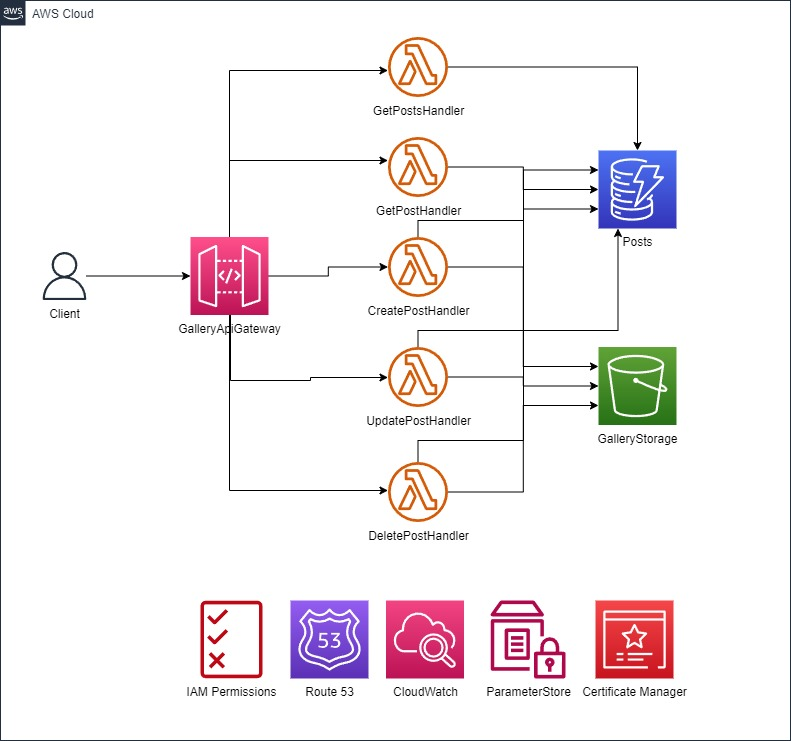

# Gallery Api

A gallery consisting of saving post information. Entire environment built using the AWS ecosystem.

# Resources used:

- Gateway API
- Lambda
- DynamoDB
- S3
- IAM
- route 53
- CloudWatch
- Parameter Store
- Certificate Manager

# Architecture

&nbsp;&nbsp;

## Useful commands

- `npm run build` compile typescript to js
- `npm run watch` watch for changes and compile
- `npm run test` perform the jest unit tests
- `cdk deploy` deploy this stack to your default AWS account/region
- `cdk diff` compare deployed stack with current state
- `cdk synth` emits the synthesized CloudFormation template
